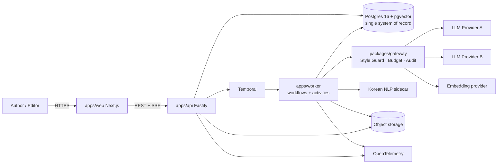
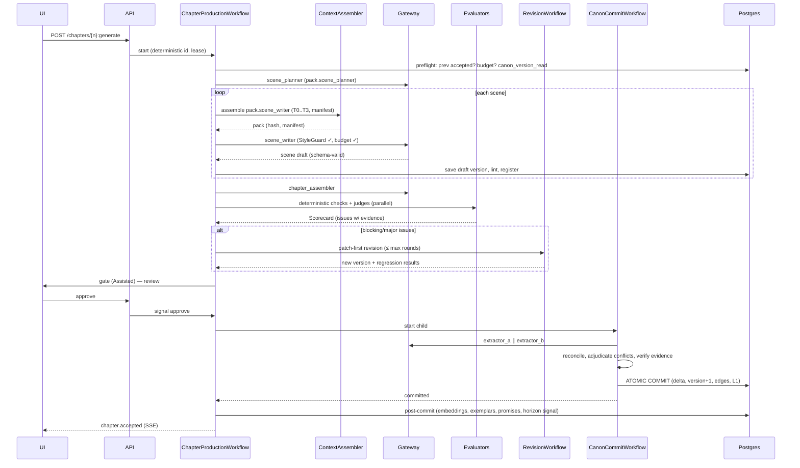
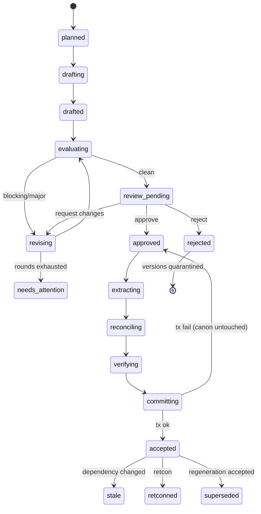
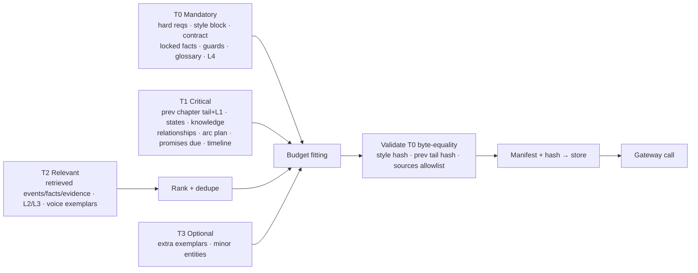
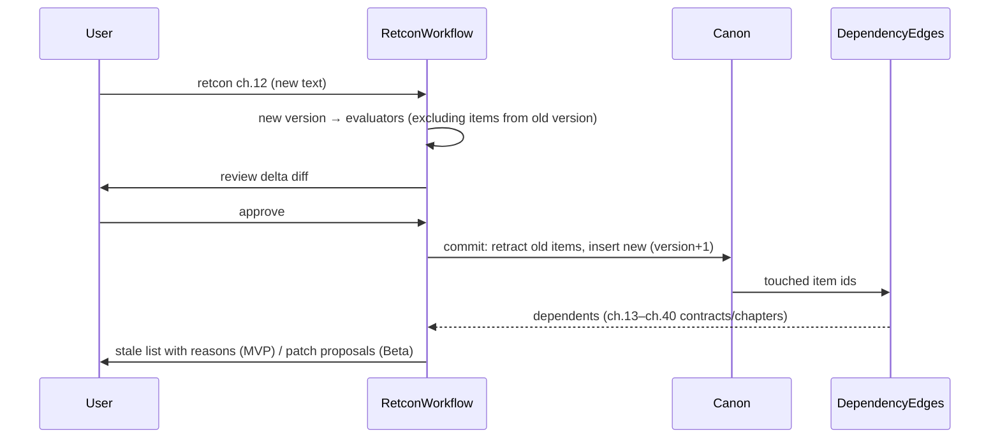

# Diagrams

Mermaid sources. Render with any Mermaid-capable viewer.

## 1. System context



## 2. Chapter production workflow (sequence)



## 3. Canon commit (state machine of a chapter)



## 4. Memory layers and data flow

```mermaid
flowchart TB
  subgraph Inputs
    REQ[Story Spec\nhard/soft/assumptions]
    BIB[Story Bible\n+ locked facts]
    PLAN[Plans\n(frame=plan)]
  end
  subgraph Canon["Canon (accepted chapters only)"]
    MV[Manuscript versions\n(immutable)]
    FACT[Facts (bitemporal)\n+ evidence spans]
    EVT[Events + reality frames]
    KNOW[Knowledge ledger]
    REL[Relationships]
    PROM[Promise ledger]
    SUM[Summaries L1–L4]
    IDX[Lexical + vector index]
  end
  subgraph Quarantine
    QD[Rejected drafts / candidates]
    FB[Raw feedback]
  end
  REQ --> PACK[Context Pack Assembler]
  BIB --> PACK
  PLAN -->|labelled 예정| PACK
  FACT --> PACK
  EVT --> PACK
  KNOW --> PACK
  REL --> PACK
  PROM --> PACK
  SUM --> PACK
  IDX --> PACK
  MV -->|prev chapter tail| PACK
  PACK --> LLM[LLM roles]
  LLM --> DRAFT[Draft versions]
  DRAFT -->|accepted| MV
  MV -->|extract → reconcile → verify| DELTA[Canon Delta]
  DELTA -->|atomic commit| FACT
  DELTA --> EVT
  DELTA --> KNOW
  DELTA --> REL
  DELTA --> PROM
  DELTA --> SUM
  SUM --> IDX
  DRAFT -->|rejected| QD
  QD -.->|never| PACK
  FB -.->|never| PACK
```

## 5. Context pack tiers



## 6. Knowledge ledger example (regression + hidden identity)

```mermaid
flowchart TB
  P1["명제 P1: 도윤은 회귀자다 (true)"]
  P2["명제 P2: 서하는 공작가의 사생아다 (true, secret)"]
  P3["명제 P3: 도윤은 첩자다 (false — 카일이 퍼뜨린 거짓)"]
  DY[도윤] -->|knows (prior_loop_memory)| P1
  SH[서하] -->|unaware → suspects ch.31 → knows ch.58| P1
  KL[카일] -->|knows (told by 백작 ch.17)| P2
  SH -->|unaware until ch.72| P2
  RD[reader] -->|knows ch.17| P2
  SH -->|believes_false ch.23 → doubts ch.40 → knows false ch.58| P3
  KL -->|knows it is false (liar)| P3
```

## 7. Retcon propagation


