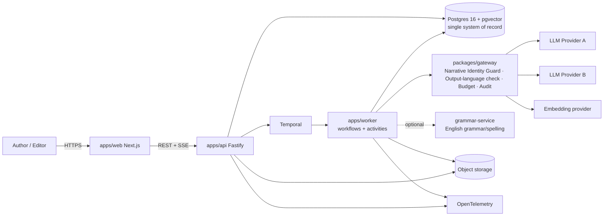
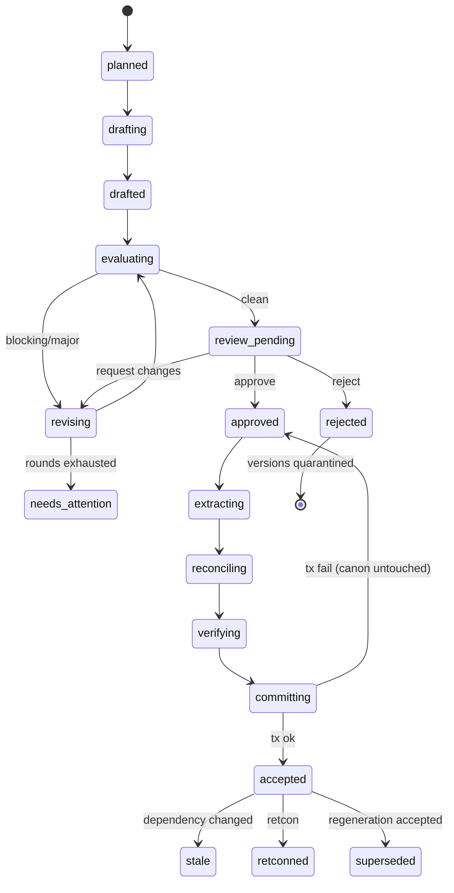
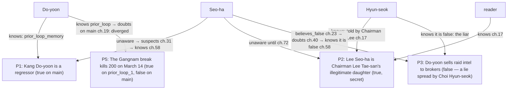
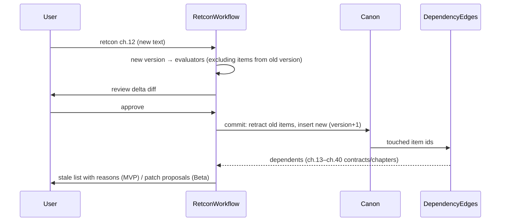

# Diagrams

Mermaid sources. Render with any Mermaid-capable viewer.

## 1. System context



## 2. Chapter production workflow (sequence)

```mermaid
sequenceDiagram
  participant UI
  participant API
  participant WF as ChapterProductionWorkflow
  participant CTX as ContextAssembler
  participant GW as Gateway
  participant EV as Evaluators
  participant RV as RevisionWorkflow
  participant CC as CanonCommitWorkflow
  participant DB as Postgres

  UI->>API: POST /chapters/{n}:generate
  API->>WF: start (deterministic id, lease)
  WF->>DB: preflight: prev accepted? budget? canon_version_read
  WF->>GW: scene_planner (pack.scene_planner)
  loop each scene
    WF->>CTX: assemble pack.scene_writer (T0..T3, manifest)
    CTX-->>WF: pack (hash, manifest)
    WF->>GW: scene_writer (Identity Guard ✓ both contracts, budget ✓)
    GW-->>WF: scene draft (schema-valid, English ✓ output-language check)
    WF->>DB: save draft version, prose+structure lint, register check
  end
  WF->>GW: chapter_assembler
  WF->>EV: deterministic checks + judges (parallel: prose · structure · genre · voice · continuity)
  EV-->>WF: Scorecard (separate dimensions; issues w/ evidence)
  alt blocking/major issues
    WF->>RV: patch-first revision (≤ max rounds)
    RV-->>WF: new version + regression results
  end
  WF->>UI: gate (Assisted) — review
  UI->>API: approve
  API->>WF: signal approve
  WF->>CC: start child
  CC->>GW: extractor_a ∥ extractor_b
  CC->>CC: reconcile, adjudicate conflicts, verify evidence
  CC->>DB: ATOMIC COMMIT (delta, version+1, edges, L1)
  CC-->>WF: committed
  WF->>DB: post-commit (embeddings, exemplars, promises, horizon signal)
  WF-->>UI: chapter.accepted (SSE)
```

## 3. Canon commit (state machine of a chapter)



## 4. Memory layers and data flow

```mermaid
flowchart TB
  subgraph Inputs
    REQ[Story Spec\nhard/soft/assumptions]
    BIB[Story Bible\n+ locked facts]
    PLAN[Plans\n(frame=plan)]
  end
  subgraph Canon["Canon (accepted chapters only)"]
    MV[Manuscript versions\n(immutable)]
    FACT[Facts (bitemporal)\n+ evidence spans]
    EVT[Events + reality frames]
    KNOW[Knowledge ledger]
    REL[Relationships]
    PROM[Promise ledger]
    SUM[Summaries L1–L4]
    IDX[Lexical + vector index]
  end
  subgraph Quarantine
    QD[Rejected drafts / candidates]
    FB[Raw feedback]
  end
  REQ --> PACK[Context Pack Assembler]
  BIB --> PACK
  PLAN -->|labelled 예정| PACK
  FACT --> PACK
  EVT --> PACK
  KNOW --> PACK
  REL --> PACK
  PROM --> PACK
  SUM --> PACK
  IDX --> PACK
  MV -->|prev chapter tail| PACK
  PACK --> LLM[LLM roles]
  LLM --> DRAFT[Draft versions]
  DRAFT -->|accepted| MV
  MV -->|extract → reconcile → verify| DELTA[Canon Delta]
  DELTA -->|atomic commit| FACT
  DELTA --> EVT
  DELTA --> KNOW
  DELTA --> REL
  DELTA --> PROM
  DELTA --> SUM
  SUM --> IDX
  DRAFT -->|rejected| QD
  QD -.->|never| PACK
  FB -.->|never| PACK
```

## 5. Context pack tiers

```mermaid
flowchart LR
  T0[T0 Mandatory\nactive constraint set · narrative identity block (both contracts) · contract\nlocked facts · guards · naming/terminology slice · L4] --> FIT[Budget fitting]
  T1[T1 Critical\nprev chapter tail+L1 · states · knowledge\nrelationships · arc plan · promises due · timeline] --> FIT
  T2[T2 Relevant\nretrieved events/facts/evidence · L2/L3 · voice exemplars] --> RANK[Rank + dedupe] --> FIT
  T3[T3 Optional\nextra exemplars · minor entities] --> FIT
  FIT --> VAL[Validate T0 byte-equality\nidentity block hash + both contract hashes · prev tail hash · sources allowlist]
  VAL --> MAN[Manifest + hash → store]
  MAN --> CALL[Gateway call]
```

## 6. Knowledge ledger example (regression + hidden identity; fixture names)



## 7. Retcon propagation


